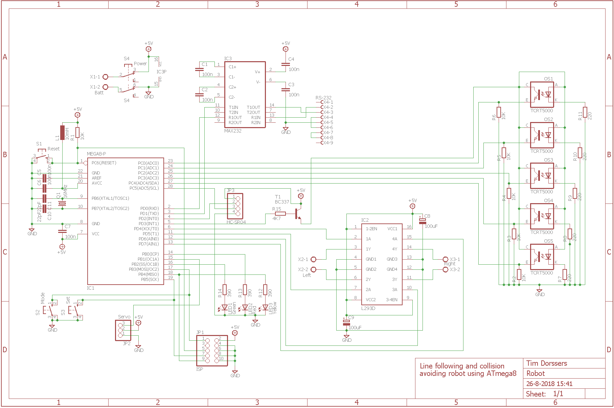

# Robot
Line following and collision avoidance robot

## Overview
In line-follow mode the robot car uses five TCRT5000 sensors connected to ADC0-ADC4 inputs to detect a dark line on a light surface or a light line on a dark surface, selected by the set button. ADC conversion is interrupt driven. The sensors can be calibrated when the robot car is in idle mode for better accuracy by holding the set button and moving the robot car over the dark and light surface. Measured values of the light and dark surface are stored in EEPROM. Weighted average calculation is used to determine the "exact" location of the line. The motors are driven by a PID control. The K values are scaled integers to avoid floating point numbers and are user configurable via UART.

In collision avoidance mode the robot car uses the HC-SR04 module and the SG90 micro servo to "look around". The servo is hardware PWM driven via OC1A output using 16-bit Timer1. The HC-SR04 module is connected to external interrupt INT0 and uses 8-bit Timer0 interrupt to measure RTT. Because of the limited "viewing" angle of the sonar, the servo sweeps between 54 and 126 degrees. When an object is detected within the turning distance, the robot performs a sweep from 0 to 180 degrees and chooses the angle with the maximum average clear distance to turn to. When an object is detected ahead within the collision distance, the robot reverses until no object is within collision distance anymore. The turning and collision distance as well as motor speeds are user configurable from the UART.

The DC motors are driven by a software PWM implementation using 8-bit Timer2 CTC interrupt and PD4-PD7 outputs connected to the L293D motor driver.

The mode button is used to switch between the different modes; line follow, collision avoid and idle. In idle mode, the robot can be driven "remotely" from the UART as well.

## Hardware
* Atmel ATmega8 @ 16 MHz
* HC-SR04 Ultrasonic Ranging Module
* L293D Motor Driver
* SG90 Micro Servo
* TCRT5000 Reflective Optical Sensor

## Schematic

## UART Control
The UART is configured for 9600 baud 8N1. The following keys are understood by the robot car:

Key | Function
---- | ----
A | Turn left
D | Turn right
W | Move forward
S | Move backward
Space | Stop
4 | Servo to right
5 | Servo to neutral
6 | Servo to left
G | Single sonar ping
O | Single ADC conversion
T | Toggle robot mode
C | Enter new collision distance
U | Enter new turning distance
M | Calibrate light surface
N | Calibrate dark line
P | Enter new Kp value
K | Enter new Kd value
I | Enter new Ki value
V | Dump non-volatile values
F | Enter new forward speed
R | Enter new reverse speed
H | Enter new turning speed high
L | Enter new turning speed low
E | Enter new retention
N | Toggle inverse mode
B | Run auto calibration
M | Enter new timeout value

## Build
The robot is built using a ZK-4WD DIY car kit that uses geared DC motors. Two circuits boards are used, one for the optical sensors and one for all other hardware. The robot can be powered by 4 AA batteries and can be operated using the two buttons and the two indicator LEDs. Red means line follow mode, green means collision detect mode and both LEDs off means idle mode. In idle mode the robot car can be controlled and configured via UART.

## Firmware
The firmware has been developed in Atmel Studio 7 using GCC C and can be uploaded to the ATmega8 using the ISP connector and an ISP programmer such as [USBasp tool](http://www.fischl.de/usbasp/) using [avrdude](http://www.nongnu.org/avrdude/):

`avrdude -p m8 -c usbasp -U flash:w:Robot.hex:i -U eeprom:w:Robot.eep:i -U hfuse:w:0xC9:m -U lfuse:w:0xFF:m`

## Gallery

 | 
---- | ----
**Line follow mode** | **Collision avoid mode**
